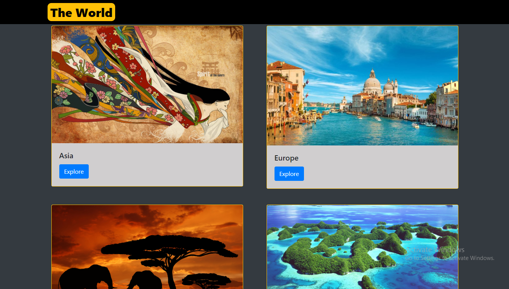
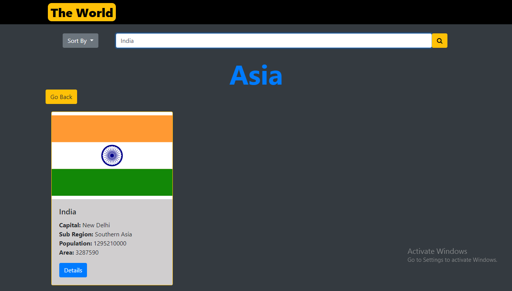
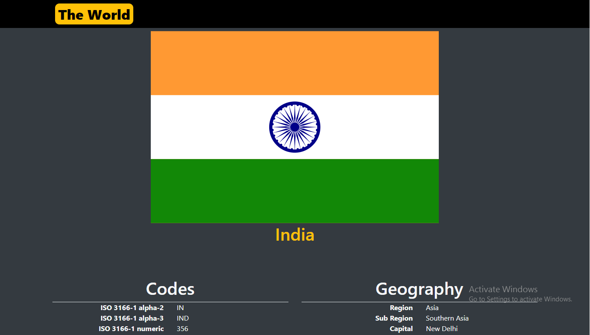

# The World

Get detailed information about all the countries of the world based on major regions, such as Asia, Africa, etc. It also has the feature to filter the countries of a region based on name, languages spoken and currencies used in the country. The API used for backend is https://restcountrie.eu

[Click here](https://sharan3009.github.io/theworld/) to check the website.

### Screenshots:

- Home Page:

- Countries View:

- Country Details View:

### Built With

- Angular 6
- Bootstrap